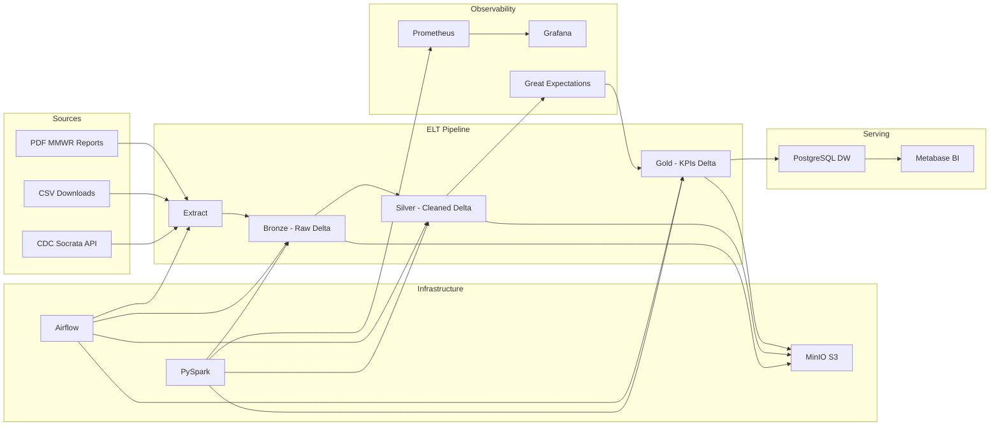

# CDC Data Lakehouse — Plateforme Medallion

Plateforme **Data Lake + Warehouse** pour analyser les données publiques de santé du **CDC (Centers for Disease Control and Prevention)**, basée sur l'architecture **Medallion Bronze → Silver → Gold**.

## Architecture



## Stack technique

| Composant | Technologie |
|-----------|-------------|
| Langage | Python 3.11 |
| Processing | PySpark 3.5 + Delta Lake |
| Stockage objet | MinIO (S3-compatible) |
| Data Warehouse | PostgreSQL 16 |
| Orchestration | Apache Airflow 2.8 |
| Data Quality | Great Expectations |
| Monitoring | Prometheus + Grafana |
| BI Dashboard | Metabase |
| Conteneurisation | Docker Compose |

## Structure du projet

```
Projet_Datalake_CDC/
├── README.md                    # Ce fichier
├── docker-compose.yml           # Stack complète Docker
├── requirements.txt             # Dépendances Python
├── .env.example                 # Variables d'environnement
├── Dockerfile.metrics           # Image exporter Prometheus
├── dags/
│   └── cdc_lakehouse_pipeline.py  # DAG Airflow principal
├── src/
│   ├── ingestion/               # Extract : API, CSV, PDF
│   ├── bronze/                  # Load : données brutes Delta
│   ├── silver/                  # Transform : nettoyage + PDF
│   ├── gold/                    # KPIs + chargement PostgreSQL
│   ├── quality/                 # Great Expectations
│   ├── monitoring/              # Métriques Prometheus
│   └── utils/                   # Config, Spark, MinIO, Logger
├── configs/
│   ├── datasets.yaml            # Datasets CDC configurés
│   ├── settings.yaml            # Configuration globale
│   └── prometheus.yml           # Config Prometheus
├── data/                        # Données locales (dev)
├── scripts/
│   ├── run_pipeline.sh          # Lancement Linux/Mac
│   ├── run_pipeline.ps1         # Lancement Windows
│   └── init_warehouse.sql       # Schéma PostgreSQL Gold
├── notebooks/                   # Jupyter notebooks
├── dashboards/grafana/          # Dashboard Grafana JSON
└── docs/
    └── report.md                # Rapport final du projet
```

## Prérequis

- **Docker** 24+ et **Docker Compose** v2
- **Python** 3.11+ (pour exécution locale hors Docker)
- **8 Go RAM** minimum (16 Go recommandé pour mode `full`)
- Connexion Internet (téléchargement données CDC)

## Installation

### 1. Cloner et configurer

```bash
git clone <repo-url> Projet_Datalake_CDC
cd Projet_Datalake_CDC
cp .env.example .env
```

### 2. Lancer l'infrastructure Docker

```bash
# Créer le répertoire Airflow (Linux/Mac)
mkdir -p data/airflow-logs
echo -e "AIRFLOW_UID=$(id -u)" >> .env

# Démarrer tous les services
docker compose up -d

# Vérifier les services
docker compose ps
```

### 3. Accès aux interfaces

| Service | URL | Credentials |
|---------|-----|-------------|
| Airflow | http://localhost:8088 | admin / admin |
| MinIO Console | http://localhost:9001 | minioadmin / minioadmin |
| Grafana | http://localhost:3000 | admin / admin |
| Prometheus | http://localhost:9090 | — |
| Metabase | http://localhost:3001 | (setup initial) |
| **KPI Dashboard** | **http://localhost:8500** | **Front KPI Gold (auto)** |
| **Spark Master UI** | **http://localhost:8080** | Interface web (workers, jobs) |
| Spark cluster (RPC) | `spark://localhost:7077` | Protocole cluster uniquement — **pas d'URL navigateur** |
| PostgreSQL | localhost:5432 | cdc_user / cdc_password |

> **Spark : ne pas ouvrir le port 7077 dans le navigateur.** Ce port sert à la communication interne du cluster (`spark://`). L'interface web est sur le **port 8080**.

## Modes d'exécution

### Mode `sample` (défaut — tests rapides)

```bash
# Via script local (nécessite Python 3.11 + Java)
./scripts/run_pipeline.sh sample all        # Linux/Mac
.\scripts\run_pipeline.ps1 -Mode sample   # Windows

# Via Docker (recommandé sur Windows)
.\scripts\run_pipeline_docker.ps1 -Mode sample -Step all

# Via Docker/Airflow
# Déclencher le DAG "cdc_lakehouse_pipeline" dans Airflow UI
```

- ~1000 lignes par dataset
- 5 pages max par PDF
- Durée : 3-5 minutes

### Mode `full` (volume 5GB+)

```bash
# Modifier .env
DATA_MODE=full
CDC_APP_TOKEN=<votre_token_socrata>   # recommandé

.\scripts\run_pipeline.ps1 -Mode full -Step all   # Windows
./scripts/run_pipeline.sh full all                # Linux/Mac
```

- Pagination complète API Socrata (keyset sur `:id`, pages de 50 000 lignes)
- Téléchargement CSV en streaming (pas de chargement en mémoire)
- PDF complets
- Durée estimée : **30-60 minutes**
- RAM recommandée : **16 Go**

## Pipeline étape par étape

```bash
# Exécution manuelle de chaque étape
./scripts/run_pipeline.sh sample extract     # 1. Télécharger données CDC
./scripts/run_pipeline.sh sample bronze      # 2. Charger en Bronze Delta
./scripts/run_pipeline.sh sample silver      # 3. Nettoyer → Silver
./scripts/run_pipeline.sh sample quality     # 4. Contrôles qualité
./scripts/run_pipeline.sh sample gold        # 5. Construire KPIs Gold
./scripts/run_pipeline.sh sample warehouse   # 6. Charger PostgreSQL
```

### DAG Airflow

Le DAG `cdc_lakehouse_pipeline` enchaîne automatiquement :

```
start → extract_cdc_data → load_bronze → transform_silver
      → run_quality_checks → build_gold → load_warehouse
      → publish_metrics → end
```

- **Retries** : 2 tentatives, délai 5 min
- **Schedule** : quotidien (`@daily`)
- **Timeout** : 2 heures

## Couches Medallion

### Bronze — Données brutes

- Fichiers originaux (CSV, JSON) stockés en **Delta Lake** sans modification métier
- Métadonnées d'ingestion : `source`, `filename`, `ingestion_time`, `file_size`, `format`, `status`
- Registre PDF (métadonnées uniquement, binaires dans MinIO)

### Silver — Données nettoyées

- Normalisation dates, États US, types numériques
- Suppression doublons, gestion nulls
- Validation : cas/décès/hospitalisations ≥ 0
- Extraction texte PDF → JSON structuré
- Contrôles **Great Expectations**

### Gold — KPIs métier

| KPI | Description |
|-----|-------------|
| `kpi_incidence_by_region` | Incidence et mortalité par État |
| `kpi_cases_per_day` | Nouveaux cas quotidiens |
| `kpi_deaths_per_day` | Décès quotidiens |
| `kpi_hospitalizations_by_region` | Hospitalisations par région |
| `kpi_vaccination_vs_cases` | Vaccination vs nouveaux cas |
| `kpi_temporal_evolution_by_state` | Évolution temporelle |

## Exemples de requêtes SQL

```sql
-- Dashboard principal
SELECT * FROM gold.v_kpi_dashboard
WHERE report_date >= CURRENT_DATE - INTERVAL '30 days'
ORDER BY report_date DESC;

-- Top États par cas
SELECT state, SUM(new_cases) AS total
FROM gold.kpi_cases_per_day
GROUP BY state ORDER BY total DESC LIMIT 10;

-- Tendances temporelles
SELECT * FROM gold.v_temporal_trends
WHERE state = 'California' AND metric_name = 'new_cases';
```

## Dashboard KPI (frontend)

Un **tableau de bord web** lit les KPIs Gold depuis PostgreSQL et affiche graphiques + tableaux.

```bash
docker compose up -d kpi-dashboard
```

Ouvrez **http://localhost:8500**

Contenu affiché :
- Cartes résumé (cas, décès, États, vaccinations)
- Courbes d'évolution cas / décès
- Top 10 États par cas
- Tableaux régionaux et vue consolidée `gold.v_kpi_dashboard`

> Prérequis : avoir exécuté le pipeline jusqu'à l'étape `warehouse`  
> `.\scripts\run_pipeline_docker.ps1 -Mode sample -Step all`

## Monitoring

Les métriques Prometheus sont exposées sur `http://localhost:8000/metrics` :

- `cdc_files_read_total` — fichiers lus
- `cdc_rows_inserted_total` / `cdc_rows_rejected_total`
- `cdc_job_duration_seconds` — durée des jobs
- `cdc_bytes_processed_total` — volume traité
- `cdc_errors_total` — erreurs par couche
- `cdc_data_freshness_seconds` — fraîcheur des données

Dashboard Grafana pré-provisionné dans `dashboards/grafana/`.

## Sources de données

Toutes les données sont **publiques** (aucune donnée privée) :

- [CDC Open Data](https://data.cdc.gov/)
- [API Socrata CDC](https://dev.socrata.com/)
- [MMWR Reports](https://www.cdc.gov/mmwr/)

## Développement local (sans Docker)

```bash
python -m venv .venv
source .venv/bin/activate  # Windows: .venv\Scripts\activate
pip install -r requirements.txt
cp .env.example .env
# Configurer MINIO_ENDPOINT=http://localhost:9000 etc.

export PYTHONPATH=src
python -m ingestion.extract
```

## Dépannage

| Problème | Solution |
|----------|----------|
| MinIO bucket manquant | `docker compose up minio-init` |
| Airflow DAG non visible | Vérifier `dags/` monté, redémarrer scheduler |
| Spark `ERR_EMPTY_RESPONSE` sur `:7077` | Utiliser **http://localhost:8080** (UI web). Le port 7077 n'est pas HTTP. |
| Erreur Spark S3A | Vérifier credentials MinIO dans `.env` |
| API CDC timeout | Mode `full` : vérifier `CDC_APP_TOKEN`, pagination keyset dans `configs/settings.yaml` |
| Python 3.13 / pip échoue | Utiliser `.\scripts\run_pipeline_docker.ps1` (Python 3.11 dans Docker) |
| Bronze : chemins introuvables | Relancer extract ; les chemins sont relatifs (`data/raw/...`) |
| PostgreSQL connexion refusée | Attendre healthcheck, `docker compose logs postgres` |

## Documentation complémentaire

- [Rapport final du projet](docs/report.md)
- [Configuration datasets](configs/datasets.yaml)
- [Notebook exploration KPIs](notebooks/explore_gold_kpis.ipynb)

## Licence

Projet éducatif — données CDC sous licence publique gouvernementale US.
