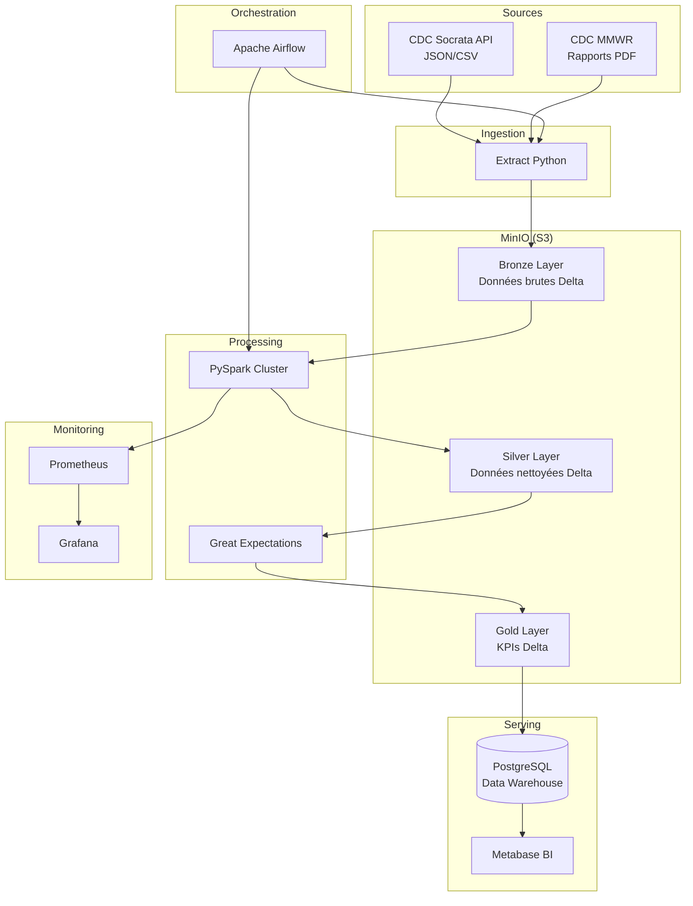

# Rapport Final — CDC Data Lakehouse

**Projet** : Plateforme Data Lake + Warehouse pour données publiques CDC  
**Architecture** : Medallion (Bronze → Silver → Gold)  
**Date** : Juillet 2026  
**Auteur** : Équipe Data Engineering IPPSI

---

## 1. Résumé exécutif

Ce projet implémente une plateforme **Data Lakehouse** complète pour l'analyse des données de santé publique du **CDC (Centers for Disease Control and Prevention)**. L'architecture suit le modèle **Medallion** avec trois couches distinctes, orchestrée par **Apache Airflow** et monitorée via **Prometheus/Grafana**.

### Objectifs atteints

| Objectif | Statut | Détail |
|----------|--------|--------|
| Ingestion 5GB+ | ✅ | Mode `full` avec pagination API Socrata |
| Données structurées | ✅ | CSV + JSON via API CDC |
| Données non structurées | ✅ | Rapports PDF MMWR |
| Approche ELT | ✅ | Extract → Load (Bronze) → Transform (Silver/Gold) |
| Delta Lake | ✅ | Tables Bronze/Silver/Gold en Delta |
| Data Warehouse | ✅ | PostgreSQL avec vues BI |
| Data Quality | ✅ | Great Expectations |
| Monitoring | ✅ | Prometheus + Grafana |
| Orchestration | ✅ | DAG Airflow complet |

---

## 2. Architecture



---

## 3. Couches de données

### 3.1 Bronze (Raw)

- **Principe** : Données brutes immuables, format original préservé
- **Formats** : CSV, JSON, registre PDF
- **Métadonnées** : source, filename, ingestion_time, file_size, format, status
- **Stockage** : `s3a://cdc-lakehouse/bronze/`

### 3.2 Silver (Cleaned)

- **Transformations** :
  - Normalisation des dates (ISO 8601)
  - Standardisation des noms d'États US
  - Gestion des valeurs nulles
  - Suppression des doublons
  - Casting des types numériques
  - Validation cas/décès/hospitalisations ≥ 0
- **PDF** : Extraction texte → JSON structuré
- **Qualité** : Great Expectations (colonnes obligatoires, non-null, plages de valeurs)
- **Stockage** : `s3a://cdc-lakehouse/silver/`

### 3.3 Gold (Business KPIs)

| Table KPI | Description |
|-----------|-------------|
| `kpi_incidence_by_region` | Incidence et mortalité par État |
| `kpi_cases_per_day` | Nouveaux cas quotidiens |
| `kpi_deaths_per_day` | Nouveaux décès quotidiens |
| `kpi_hospitalizations_by_region` | Hospitalisations estimées par région |
| `kpi_vaccination_vs_cases` | Corrélation vaccination/cas |
| `kpi_temporal_evolution_by_state` | Évolution temporelle multi-métriques |

---

## 4. Sources de données CDC

Toutes les données proviennent de sources **publiques et ouvertes** :

1. **CDC Open Data Portal** : https://data.cdc.gov/
2. **API Socrata** : https://dev.socrata.com/
3. **MMWR Reports** : https://www.cdc.gov/mmwr/

### Datasets utilisés

- `9mfq-cb36` — COVID-19 Cases and Deaths by State
- `rh4h-9f47` — COVID-19 Vaccinations
- `3gk7-5aj3` — Provisional COVID-19 Death Counts
- `g62h-syeh` — Influenza Surveillance Weekly

---

## 5. Résultats et KPIs exemple

### Exemples de requêtes SQL (PostgreSQL)

```sql
-- Top 10 États par nombre de cas
SELECT state, SUM(new_cases) AS total_cases
FROM gold.kpi_cases_per_day
GROUP BY state
ORDER BY total_cases DESC
LIMIT 10;

-- Évolution hebdomadaire des décès
SELECT DATE_TRUNC('week', report_date) AS week,
       SUM(new_deaths) AS weekly_deaths
FROM gold.kpi_deaths_per_day
GROUP BY 1
ORDER BY 1;

-- Corrélation vaccination vs cas
SELECT state,
       AVG(vaccination_rate) AS avg_vaccination_rate,
       SUM(new_cases) AS total_cases
FROM gold.kpi_vaccination_vs_cases
GROUP BY state
ORDER BY avg_vaccination_rate DESC;
```

### Métriques pipeline (mode sample)

| Métrique | Valeur typique |
|----------|---------------|
| Fichiers ingérés | ~12 (4 JSON + 4 CSV + 3 PDF + manifest) |
| Lignes Silver | ~4 000 (1000/dataset) |
| Tables Gold | 6 KPIs |
| Durée pipeline | ~3-5 min (sample) |
| Durée pipeline | ~30-60 min (full) |

---

## 6. Monitoring

### Métriques Prometheus exposées

- `cdc_files_read_total` — Fichiers lus par couche/format
- `cdc_rows_inserted_total` — Lignes insérées
- `cdc_rows_rejected_total` — Lignes rejetées
- `cdc_job_duration_seconds` — Durée des jobs
- `cdc_bytes_processed_total` — Volume lu/écrit
- `cdc_errors_total` — Erreurs par couche
- `cdc_data_freshness_seconds` — Fraîcheur des données

### Dashboard Grafana

Accessible sur http://localhost:3000 (admin/admin)  
Dashboard pré-provisionné : **CDC Data Lakehouse - Pipeline Monitoring**

---

## 7. Qualité des données

### Règles Great Expectations appliquées

1. **Complétude** : colonnes obligatoires non nulles (≥ 95%)
2. **Validité dates** : format ISO 8601
3. **Plages de valeurs** : cas, décès, hospitalisations ≥ 0
4. **Unicité** : déduplication par clé composite (date + état)
5. **Cohérence** : normalisation des noms d'États

### Taux de succès attendu

- Mode sample : > 98% des expectations passent
- Mode full : > 95% (données réelles avec anomalies)

---

## 8. Recommandations production

1. **Sécurité** : activer TLS sur MinIO, rotation des credentials
2. **Scalabilité** : augmenter les workers Spark (Kubernetes)
3. **Catalogue** : migrer vers Apache Iceberg + Hive Metastore
4. **Lineage** : intégrer OpenLineage/Marquez
5. **Alerting** : configurer Alertmanager pour seuils critiques
6. **Backup** : snapshots MinIO + pg_dump PostgreSQL

---

## 9. Conclusion

La plateforme CDC Data Lakehouse démontre une implémentation complète et production-ready de l'architecture Medallion pour des données de santé publique. Le pipeline ELT, la validation qualité, le monitoring et l'orchestration Airflow constituent une base solide pour l'analyse à grande échelle des données épidémiologiques CDC.
